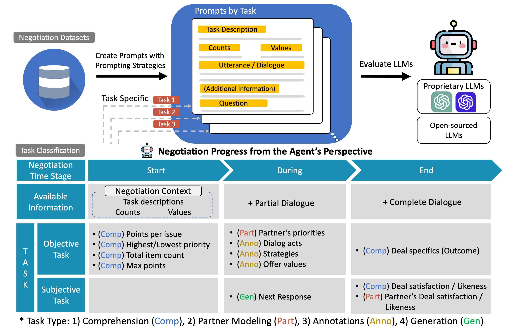

# SysEval-NegoLLMs
- This repository contains the code for a systematic evaluation of Large Language Models (LLMs) in negotiation dialogues. This work has been accepted at **Findings of EMNLP 2024**.

- Title: [Are LLMs Effective Negotiators? Systematic Evaluation of the Multifaceted Capabilities of LLMs in Negotiation Dialogues](https://arxiv.org/abs/2402.13550)


- For any queries, please contact the first author: **Brian Deuksin Kwon** (deuksink@usc.edu).

---

## Environment Setup

1. **Requirements**: This framework requires **Python ≥ 3.10**. It has been tested with Python 3.10.15 with CUDA Version 11.4

2. **Create a environment**: Create a virtual enviroment for development
```bash
conda create -n negollm python=3.10
```

3. **Install Libraries**: Under the created environment, install all required libraries using the following command:
```bash
pip install -r requirements.txt
```

3. **Set Up OpenAI API Key**: Our evaluation framework uses the OpenAI API for certain LLMs, such as GPT-3.5 and GPT-4. If you wish to evaluate these models, set your OpenAI API key as an environment variable:
```bash
export OPENAI_API_KEY="YOUR_API_KEY"
```

---

## LLM Evaluation

- Conduct a comprehensive, multifaceted evaluation of LLMs across various negotiation tasks.
- To evaluate each model, execute the relevant scripts under the scripts directory .

```bash
# Evaluate GPT-4
sh scripts/openai_gpt4.sh

# Additional Analysis for GPT-4 (including prompting strategies)
sh scripts/openai_gpt4_additional_exp.sh
```

---

## T5 (Flan-T5) Baseline
Perform training, evaluation, and generation tasks using the T5 baseline model (Flan-T5).

```{sh}
# Train
sh baselines/scripts/finetune.all.sh  # All tasks
sh baselines/scripts/finetune.task.sh # A specific task

# Evaluation
sh baselines/scripts/evaluate.sh

# Generateion
sh baselines/scripts/generate.sh
```
